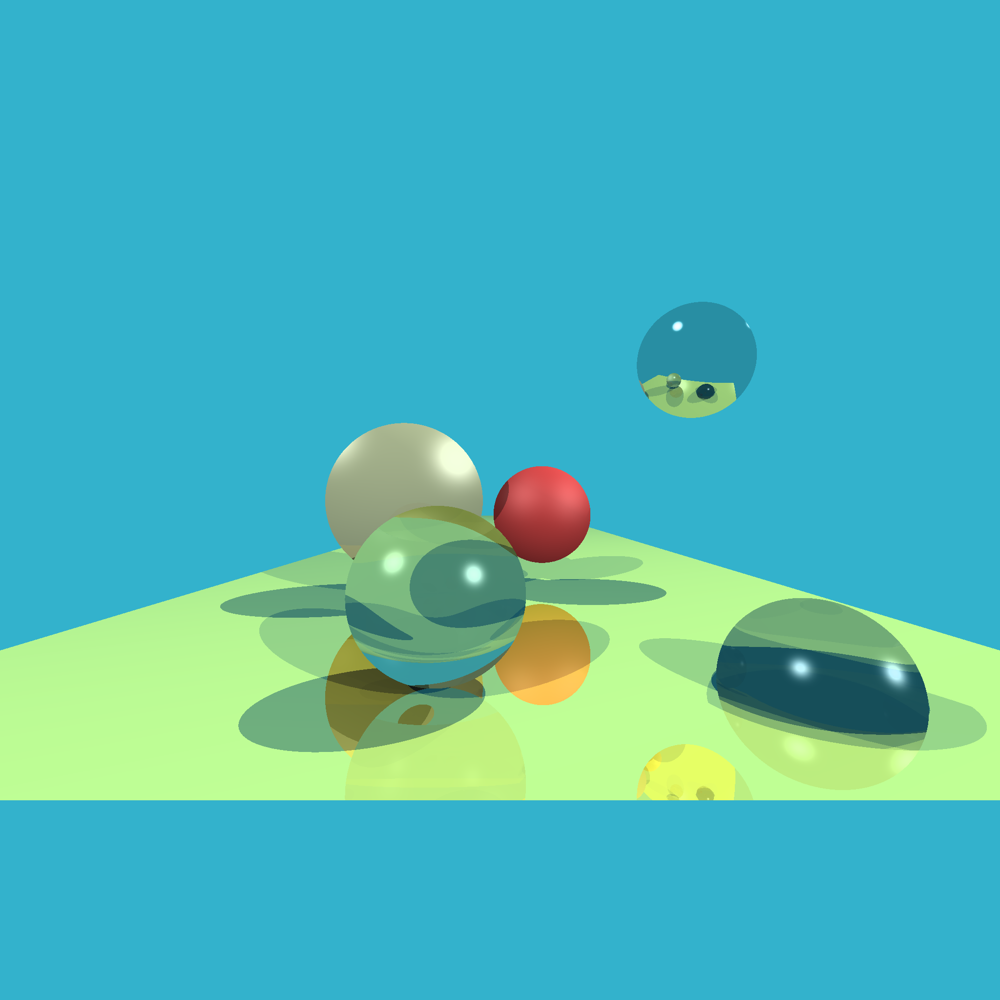

# Tyray

Toy ray tracer in Rust. Features supported:

* Sphere and plane primitives
* Reflection, refraction, diffuse, specular lighting
* Environment map
* Hard shadows
* Parallellized rendering using rayon.

Author: Tommy van der Vorst (tommy@pixelspark.nl), (C) 2019.

Inspired by ssloy's [tinyraytracer](https://github.com/ssloy/tinyraytracer).

